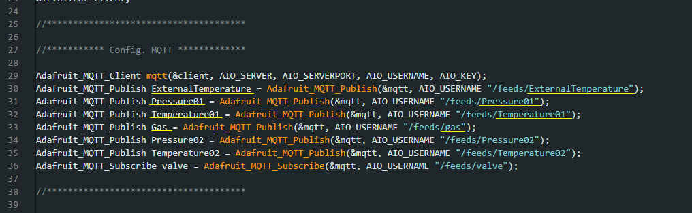
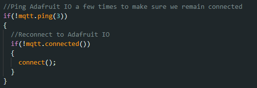
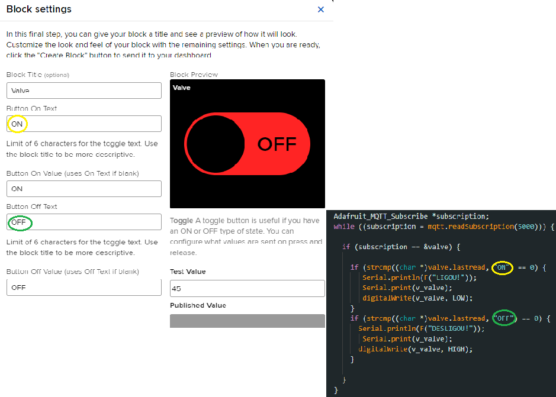

  # Solução de Problemas Adafruit:

  Tópico criado com a finalidade de auxiliar com a solução de alguns erros comuns de integração do ESP32 com o Adafruit.
  
  ## Problema 01:
   Feed não recebe dados enviados pelo esp32.

   ### Possível solução:
   Atentar-se na criação da variavel MQTT e checar se as seguintes condições forem executadas: 
   - Variável com mesmo nome da feed;
   - Alterou o endereço de envio do dado;    
  Segue imagem de como deve ser feito: 
    
   

   ## Problema 02:
   ESP32 perde conexão com o adafruit e dados não são enviados.

   ### Possível solução:
   Fundamental lembra-se de pingar algumas vezes o Adafruit para mantem a conexão intacta. Segue código que deve ser inserido no início loop:  
    

  ## Problema 03:
  Utilizar sinal digital (por ex: Ligar e Desligar de um botão) de um bloco
do adafruit e enviar sinal atráves do protocolo MQTT para ser interpretado com o ESP32.

### Possíveis Soluções:

#### Solução 01:
  Se atentar na criação da variável do tipo MQTT. Existem dois tipos principais: Adafruit_MQTT_Publish e Adafruit_MQTT_Subscribe;  

  Adafruit_MQTT_Publish será a variável utilizada para enviar informações ao adafruit;  

  Adafruit_MQTT_Subscribe será a variável utilizada para receber informações; 

  Portanto, para receber o sinal digital utilize uma variavel do tipo Adafruit_MQTT_Subscribe e use o mesmo nome da feed responsável pelo envio do sinal ao nomear a variavel.

  #### Solução 02:
  Ao criar o bloco do botão na dashboard atentar-se à colocar o mesmo valor enviado pelo feed e utilizado pela condicional no código. Para exemplificar, observe a imagem:
   
  

  Como a imagem exibe, o mesmo valor está sendo enviado e utilizado na condicional, no local correto, para acionamento da válvula.
