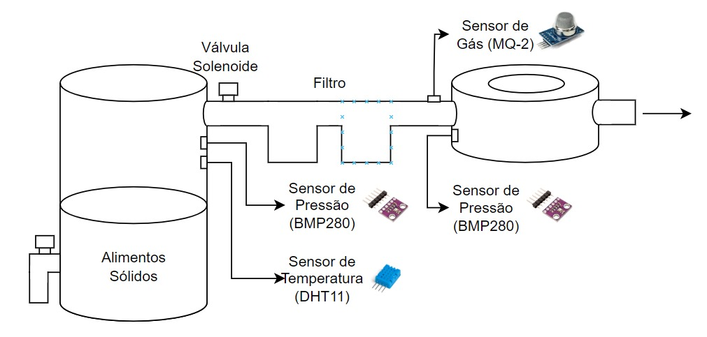

# Sistema de monitoramento de um biodigestor com ESP32 e Sensores

## Problema Resolvido

O projeto visa facilitar a operação e o monitoramento de sistemas de biodigestão, fornecendo dados precisos em tempo real sobre as condições do ambiente. Isso é crucial para o desempenho eficiente do processo de biodigestão, permitindo ajustes proativos e garantindo um funcionamento seguro e otimizado do sistema. O monitoramento contínuo das condições ambientais possibilitado pelos sensores contribui para a maximização da produção de biogás e para a sustentabilidade de sistemas de tratamento de resíduos orgânicos.

## Arquitetura do Projeto

O projeto segue uma arquitetura onde o ESP32 coleta dados dos sensores e os envia para a plataforma Adafruit via protocolo MQTT. A plataforma Adafruit recebe os dados e os exibe em um dashboard online, permitindo o monitoramento remoto do sistema de biodigestão.



## Hardware

### Visão Geral

O projeto do sistema de monitoramento de um biodigestor com ESP32 e sensores é uma solução para monitorar e otimizar o processo de biodigestão, fornecendo dados precisos em tempo real sobre as condições ambientais. Isso é fundamental para garantir um funcionamento eficiente e seguro do sistema, maximizando a produção de biogás e contribuindo para a sustentabilidade de sistemas de tratamento de resíduos orgânicos.

### Estruturação Modular do Projeto

O projeto do biodigestor foi estruturado de forma modular, segmentando o hardware em diferentes funções para facilitar o desenvolvimento, manutenção e possíveis iterações futuras. Cada componente desempenha uma função específica no monitoramento das condições do ambiente durante o processo de biodigestão.

### Componentes Utilizados

- ESP32 (microcontrolador)
- DHT11 (sensor de temperatura e umidade)
- BMP280 (sensor de pressão atmosférica)
- MQ-2 (sensor de gás)

No projeto de biodigestor, diferentes sensores desempenham funções específicas para monitorar as condições ambientais e garantir a eficiência e segurança do sistema. Aqui está como cada sensor funcionará:

### Sensor MQ-2 (Detecção de Gases Combustíveis)

O sensor MQ-2 é fundamental para detectar a presença de gases combustíveis, como metano, que podem representar riscos de vazamentos durante o processo de biodigestão. Conectado ao ESP32, o sensor fornece dados sobre a concentração de gás, permitindo alertas em tempo real caso níveis perigosos sejam detectados.

(Adicionar se achou algum erro no código e como resolveu ou alguma observação importante)

### Sensor DHT11 (Medição de Temperatura Ambiente)

O sensor DHT11 é posicionado próximo ao biodigestor para medir a temperatura ambiente. Esses dados são cruciais para monitorar o processo de biodigestão, permitindo ajustes conforme necessário para otimizar o desempenho do sistema.

(Adicionar se achou algum erro no código e como resolveu ou alguma observação importante)

### Sensor BMP280 (Medição de Pressão e Temperatura Interna)

O sensor BMP280 é colocado dentro do biodigestor para monitorar a pressão atmosférica e a temperatura interna. Conectado ao ESP32, fornece informações sobre as condições dentro do biodigestor, permitindo intervenções preventivas se necessário.

(Adicionar se achou algum erro no código e como resolveu ou alguma observação importante)

### Integração com a Plataforma Adafruit IO

Todos os dados coletados pelos sensores (MQ-2, DHT11 e BMP280) serão enviados para a plataforma Adafruit IO por meio de um ESP32. Isso permite que os dados sejam visualizados e analisados em tempo real pelos operadores, proporcionando um monitoramento abrangente do sistema de biodigestão.

(Adicionar se achou algum erro no código e como resolveu ou alguma observação importante)

## Configuração de Software

### Pinagem

| Pino (Nome no Código) | Número do Pino | Arquivo               | Observações                                                    |
| --------------------- | -------------- | --------------------- | -------------------------------------------------------------- |
| `xxxxxxx`             | xx             | xxxxxxxxxxxxxxx       | xxxxxxxxxxxxxxxxx                                              |
| `xxxxxxx`             | xx             | xxxxxxxxxxxxxxx       | xxxxxxxxxxxxxxxxx                                              |
| `xxxxxxx`             | xx             | xxxxxxxxxxxxxxx       | xxxxxxxxxxxxxxxxx                                              |
| `xxxxxxx`             | xx             | xxxxxxxxxxxxxxx       | xxxxxxxxxxxxxxxxx                                              |
| `xxxxxxx`             | xx             | xxxxxxxxxxxxxxx       | xxxxxxxxxxxxxxxxx                                              |
| `xxxxxxx`             | xx             | xxxxxxxxxxxxxxx       | xxxxxxxxxxxxxxxxx                                              |
| `xxxxxxx`             | xx             | xxxxxxxxxxxxxxx       | xxxxxxxxxxxxxxxxx                                              |
| `xxxxxxx`             | xx             | xxxxxxxxxxxxxxx       | xxxxxxxxxxxxxxxxx                                              |
| `xxxxxxx`             | xx             | xxxxxxxxxxxxxxx       | xxxxxxxxxxxxxxxxx                                              |


Observações Gerais:

-

Certifique-se de ajustar as configurações de acordo com as especificações do seu projeto.

### Ambiente de Desenvolvimento

O código-fonte foi desenvolvido na Arduino IDE, uma plataforma de desenvolvimento que permite a escrita, compilação e upload de programas para placas compatíveis com Arduino, como o ESP32 utilizado neste projeto.

### Instalação

1. Instale a última versão da Arduino IDE a partir do [site oficial](https://www.arduino.cc/en/software).
2. Configure a Arduino IDE para suportar o ESP32 seguindo as instruções disponíveis na [documentação do ESP32](https://docs.espressif.com/projects/arduino-esp32/en/latest/installing.html).
3. Instale todas as bibliotecas necessárias mencionadas no arquivo `xxxxxxxx` localizado na pasta `xxxxxxxxxxx`.

### Programa Final

A pasta Programas XXXXXXXXX contém o código-fonte consolidado que será executado no ESP32. Inclui a integração dos códigos de todos os sensores utilizados.

## Tabela de Conteúdos

- [Problema Resolvido](#problema-resolvido)
- [Componentes Utilizados](#componentes-utilizados)
- [Arquitetura do Projeto](#arquitetura-do-projeto)
- [Funcionamento dos Sensores no Projeto de Biodigestor](#funcionamento-dos-sensores-no-projeto-de-biodigestor)
- [Integração com a Plataforma Adafruit IO](#integração-com-a-plataforma-adafruit-io)
- [Instruções de Execução](#instruções-de-execução)

## Instruções de Execução

Para executar o projeto localmente, siga estas etapas:

1. **Pré-requisitos**:
   - Node.js
   - Python
   - Bibliotecas do Arduino IDE (para ESP32 e sensores)

2. **Instalação das Dependências**:
   ```bash
   # Instalar bibliotecas do Arduino IDE
   Instale as bibliotecas DHT, Adafruit BMP280 e Adafruit MQTT.
   ```

3. **Execução da Aplicação**:
   - **Carregar o Código no ESP32**:
     1. Conecte o ESP32 ao seu computador.
     2. Abra o Arduino IDE.
     3. Carregue os códigos fornecidos para cada sensor no ESP32.
        - [Código MQ-2](https://github.com/JulioAmaral007/Biodigestor/blob/main/C%C3%B3digos/codigo_mq2.txt)
        - [Código DHT11](https://github.com/JulioAmaral007/Biodigestor/blob/main/C%C3%B3digos/codigo_dht.txt)
        - [Código BMP280](https://github.com/JulioAmaral007/Biodigestor/blob/main/C%C3%B3digos/codigo_bmp.txt)
   - **Monitoramento via Adafruit IO**:
     1. Configure suas credenciais no código para conexão com a Adafruit IO.
     2. Verifique os dados em tempo real no dashboard da Adafruit IO.
