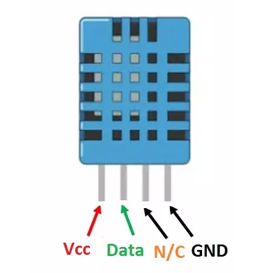

# Como usar com ESP32 – Sensor de Umidade e Temperatura DHT11

## Descrição:

O sensor DHT11 é posicionado próximo ao biodigestor para medir a temperatura ambiente. Esses dados são cruciais para monitorar o processo de biodigestão, permitindo ajustes conforme necessário para otimizar o desempenho do sistema.



## Especificações e características:

 - Tensão de operação: 3,5 a 5,5VDC;
 - Corrente de operação: 0,3mA;
 - Corrente de operação (em stand by): 60µA;
 - Resolução: 16 bits;
 - Faixa de medição (umidade): 20 a 90%;
 - Faixa de medição (temperatura): 0º a 50º celsius;
 - Precisão (umidade): ±5%;
 - Precisão (temperatura): ±2º celsius;
 - Tempo de resposta: 2s.

## Datasheet:

[Datasheet DHT](https://github.com/JulioAmaral007/Biodigestor/blob/main/Sensores/Sensor-DHT11/Datasheet%20DHT11.pdf)

## Aplicações:

Projetos com finalidade de medir umidade e temperatura ambiente utilizando ESP32 ou outras plataformas microcontroladas.

 ### Pinagem:

| Pino          | Saída      | Pino no ESP32          |
| ------------- | ---------- | ---------------------- |
| ${{\color{Red}\Huge{\textsf{  VCC \}}}}\$      | 1          | xxx |
| ${{\color{Lime}\Huge{\textsf{  Data \}}}}\$       | 2         | 4  |
| ${{\color{Goldenrod}\Huge{\textsf{  N/C \}}}}\$       | 3         | NC      |
| ${{\color{Gray}\Huge{\textsf{  GND \}}}}\$         | 4         | XX      |


## Bibliotecas:

```bash 
  #include "DHT.h"
```

## Código:

OBS: É necessário checar a pinagem do DHT11 ou o módulo em que está integrado para que não ocorra erros de leitura, há diferente versões online, detalhe que atrasou os testes do sensor no projeto.

```bash
#include "DHT.h"
#include <WiFi.h>
#include "Adafruit_MQTT.h"
#include "Adafruit_MQTT_Client.h"
 
// WiFi parameters
#define WLAN_SSID       ""
#define WLAN_PASS       ""

// Adafruit IO setup
#define AIO_SERVER      "io.adafruit.com"   // Adafruit IO Cloud Platform server for IoT
#define AIO_SERVERPORT  1883
#define AIO_USERNAME    ""
#define AIO_KEY         ""
WiFiClient client;
 
// Setup the MQTT client class by passing in the WiFi client and MQTT server and login details.
Adafruit_MQTT_Client mqtt(&client, AIO_SERVER, AIO_SERVERPORT, AIO_USERNAME, AIO_KEY);
Adafruit_MQTT_Publish Temperature = Adafruit_MQTT_Publish(&mqtt, AIO_USERNAME "/feeds/Temperature");
Adafruit_MQTT_Publish Humidity = Adafruit_MQTT_Publish(&mqtt, AIO_USERNAME "/feeds/Humidity");

#define DHTPIN 4       // Set the pin connected to the DHT11 data pin
#define DHTTYPE DHT11  // DHT 11

DHT dht(DHTPIN, DHTTYPE);

void setup() {
  
  Serial.begin(115200);
  
  Serial.println(F("Adafruit IO Example"));
  // Connect to WiFi access point.
  Serial.println(); Serial.println();
  delay(10);
  Serial.print(F("Connecting to "));
  Serial.println(WLAN_SSID);
  WiFi.begin(WLAN_SSID, WLAN_PASS);
  while (WiFi.status() != WL_CONNECTED)
  {
    delay(500);
    Serial.print(F("."));
  }
  Serial.println();
  Serial.println(F("WiFi connected"));
  Serial.println(F("IP address: "));
  Serial.println(WiFi.localIP());
 
  // connect to adafruit io
  connect();

  dht.begin();
}

void connect()
{
  Serial.print(F("Connecting to Adafruit IO... "));
  int8_t ret;
  while ((ret = mqtt.connect()) != 0)
  {
    switch (ret)
    {
      case 1: Serial.println(F("Wrong protocol")); break;
      case 2: Serial.println(F("ID rejected")); break;
      case 3: Serial.println(F("Server unavail")); break;
      case 4: Serial.println(F("Bad user/pass")); break;
      case 5: Serial.println(F("Not authed")); break;
      case 6: Serial.println(F("Failed to subscribe")); break;
      default: Serial.println(F("Connection failed")); break;
    }
 
    if(ret >= 0)
      mqtt.disconnect();
 
    Serial.println(F("Retrying connection..."));
    delay(10000);
  }
  Serial.println(F("Adafruit IO Connected!"));
}
 

 
void loop() {

   // ping adafruit io a few times to make sure we remain connected
  if(! mqtt.ping(3))
  {
    // reconnect to adafruit io
    if(! mqtt.connected())
      connect();
  }

   // Sensor readings may also be up to 2 seconds 'old' (it's a very slow sensor)
  float hum = dht.readHumidity();
  // Read temperature as Celsius (the default)
  float temp = dht.readTemperature();
  
   if (isnan(hum) || isnan(temp)) {
    Serial.println("Failed to read from DHT sensor!");
    return;
  }
  
  Serial.println("-----------");
  //Serial.println(esp_random());
  Serial.print("Humidade: ");
  Serial.print(hum, 3);
  Serial.print("% | Temperatura: ");
  Serial.print(temp, 3);
  Serial.print("°C");

    delay(5000);
  
  if (! Temperature.publish(temp)) {               //Publish Temperature data to Adafruit
      Serial.println(F("Failed"));
    }
       if (! Humidity.publish(hum)) {               //Publish Humidity data to Adafruit
      Serial.println(F("Failed"));
    }
    else {
      Serial.println(F("Sent!"));
    }

}
```
