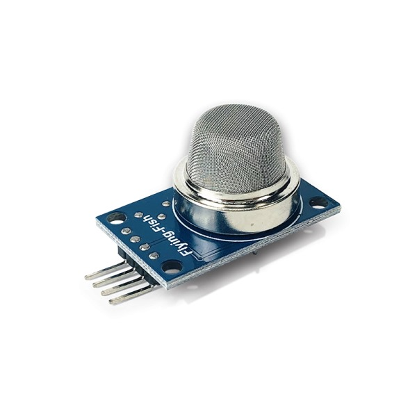

# Como usar com ESP32 – Sensor de Umidade e Temperatura DHT11

## Descrição

O sensor MQ-2 é fundamental para detectar a presença de gases combustíveis, como metano, que podem representar riscos de vazamentos durante o processo de biodigestão. Conectado ao ESP32, o sensor fornece dados sobre a concentração de gás, permitindo alertas em tempo real caso níveis perigosos sejam detectados.

OBS: o Sensor (Detector) de Gás Inflamável / Fumaça – MQ-2 deve ser utilizado para propósitos experimentais. Não recomendamos o uso do mesmo em projetos profissionais ou que envolva segurança humana ou ambiental. Além disso, não nos responsabilizamos por eventuais danos.



## Especificações e características:

 - Controlador: LM393
 - Tensão de operação: 5VDC
 - Concentração de detecção: 300 – 10.000ppm
 - Detecção: fumaça, gás natural, metano, propano, butano, GLP, hidrogênio e outros inflamáveis
 - Saída Digital e Analógica
 - LED indicador para  presença de tensão
 - LED indicador para saída digital
 - Sensibilidade ajustável através de trimpot

## Datasheet:

[Datasheet MQ-2](https://github.com/JulioAmaral007/Biodigestor/blob/main/Sensores/Sensor-MQ2/Datasheet%20MQ2.pdf)

## Aplicações:

Projetos com Arduino ou outras plataformas microcontroladas em que seja necessário fazer a detecção de fumaça, gás natural, metano, propano, butano, GLP, hidrogênio e outros inflamáveis.

## Proposta da prática:

Utilizar o Sensor (Detector) de Gás Inflamável / Fumaça – MQ-2 em conjunto com o ESP32 e acender um LED sempre que o sensor fizer a detecção da presença do gás exalado pelo isqueiro.

## Lista dos itens necessários:

 - ESP32 com Cabo USB
 - Sensor (Detector) de Gás Inflamável / Fumaça – MQ-2
 - Cabos Jumper macho-fêmea

## Código:

OBS: É necessário que o sensor seja alimentado com uma tensão de 5V, assim como o ESP32, para que consiga realizar a leitura precisa dos dados analógicos.

```bash
#include <Wire.h>
#include <WiFi.h>
#include "Adafruit_MQTT.h"
#include "Adafruit_MQTT_Client.h"

#define WLAN_SSID       ""
#define WLAN_PASS       ""

// Adafruit IO setup
#define AIO_SERVER      "io.adafruit.com"   // Adafruit IO Cloud Platform server for IoT
#define AIO_SERVERPORT  1883
#define AIO_USERNAME    ""
#define AIO_KEY         ""
WiFiClient client;

Adafruit_MQTT_Client mqtt(&client, AIO_SERVER, AIO_SERVERPORT, AIO_USERNAME, AIO_KEY);
Adafruit_MQTT_Publish Gas = Adafruit_MQTT_Publish(&mqtt, AIO_USERNAME "/feeds/gas1");

#define sensor 4


void setup() {
    
    Serial.begin(115200);

    Serial.println(WLAN_SSID);
    WiFi.begin(WLAN_SSID, WLAN_PASS);
    while (WiFi.status() != WL_CONNECTED)
    {
      delay(500);
      Serial.print(F("."));
    }
    Serial.println();
    Serial.println(F("WiFi connected"));
    Serial.println(F("IP address: "));
    Serial.println(WiFi.localIP());
 
    // connect to adafruit io
    connect();

}

void connect()
{
  Serial.print(F("Connecting to Adafruit IO... "));
  int8_t ret;
  while ((ret = mqtt.connect()) != 0)
  {
    switch (ret)
    {
      case 1: Serial.println(F("Wrong protocol")); break;
      case 2: Serial.println(F("ID rejected")); break;
      case 3: Serial.println(F("Server unavail")); break;
      case 4: Serial.println(F("Bad user/pass")); break;
      case 5: Serial.println(F("Not authed")); break;
      case 6: Serial.println(F("Failed to subscribe")); break;
      default: Serial.println(F("Connection failed")); break;
    }
 
    if(ret >= 0)
      mqtt.disconnect();
 
    Serial.println(F("Retrying connection..."));
    delay(10000);
  }
  Serial.println(F("Adafruit IO Connected!"));
}

void loop() {
    
      // ping adafruit io a few times to make sure we remain connected
    if(! mqtt.ping(3))
    {
    // reconnect to adafruit io
    if(! mqtt.connected())
      connect();
    }
    
    int value = analogRead(sensor);
    value = map(value, 0, 4095, 0, 100);

    Serial.print("GAS Level :");
    Serial.println(value);

    delay(5000);

    if (!Gas.publish(value)) {               //Publish Temperature data to Adafruit
      Serial.println(F("Failed"));
    }
    else{
       Serial.println(F("Sent!"));
    } 
}
```