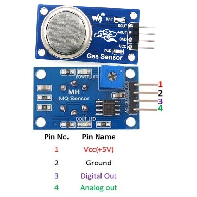

# Como usar com ESP32 – Sensor de Gás MQ2

## Descrição:

O sensor MQ-2 é fundamental para detectar a presença de gases combustíveis, como metano, que podem representar riscos de vazamentos durante o processo de biodigestão. Conectado ao ESP32, o sensor fornece dados sobre a concentração de gás, permitindo alertas em tempo real caso níveis perigosos sejam detectados.

OBS: o Sensor (Detector) de Gás Inflamável / Fumaça – MQ-2 deve ser utilizado para propósitos experimentais. Não recomendamos o uso do mesmo em projetos profissionais ou que envolva segurança humana ou ambiental. Além disso, não nos responsabilizamos por eventuais danos.



## Especificações e características:

 - Controlador: LM393;
 - Tensão de operação: 5VDC;
 - Concentração de detecção: 300 – 10.000ppm;
 - Detecção: fumaça, gás natural, metano, propano, butano, GLP, hidrogênio e outros inflamáveis;
 - Saída Digital e Analógica;
 - LED indicador para  presença de tensão;
 - LED indicador para saída digital;
 - Sensibilidade ajustável através de trimpot.

## Datasheet:

[Datasheet MQ-2](https://github.com/JulioAmaral007/Biodigestor/blob/main/Sensores/Sensor-MQ2/Datasheet%20MQ2.pdf)

## Aplicações:

Projetos com Arduino ou outras plataformas microcontroladas em que seja necessário fazer a detecção de fumaça, gás natural, metano, propano, butano, GLP, hidrogênio e outros inflamáveis.

### Pinagem:

| Pino          | Saída      | Pino no ESP32          |
| ------------- | ---------- | ---------------------- |
| ${{\color{Red}\Huge{\textsf{  VCC(+5V) \}}}}\$    | 1          | VIN |
| ${{\color{Gray}\Huge{\textsf{  GND \}}}}\$      | 2         | GND   |
| ${{\color{Violet}\Huge{\textsf{  Digital\ Out\ \}}}}\$       | 3         | NC      |
| ${{\color{Lime}\Huge{\textsf{  Analog\ Out\ \}}}}\$        | 4         | D35       |


## Bibliotecas:

```bash 
#include <MQSpaceData.h>
```

## Código:

OBS: É necessário que o sensor seja alimentado com uma tensão de 5V, assim como o ESP32, para que consiga realizar a leitura precisa dos dados analógicos.

```bash

#include <MQSpaceData.h>
#include <Wire.h>
#include <WiFi.h>
#include "Adafruit_MQTT.h"
#include "Adafruit_MQTT_Client.h"

#define WLAN_SSID       ""
#define WLAN_PASS       ""

// Adafruit IO setup
#define AIO_SERVER      "io.adafruit.com"   // Adafruit IO Cloud Platform server for IoT
#define AIO_SERVERPORT  1883
#define AIO_USERNAME    ""
#define AIO_KEY         ""
WiFiClient client;

Adafruit_MQTT_Client mqtt(&client, AIO_SERVER, AIO_SERVERPORT, AIO_USERNAME, AIO_KEY);
Adafruit_MQTT_Publish Gas = Adafruit_MQTT_Publish(&mqtt, AIO_USERNAME "/feeds/gas1");

#define ADC_BIT_RESU  (12) 
#define ANALOG_PIN    (A7)
MQSpaceData MQ(ADC_BIT_RESU, ANALOG_PIN);

float MQ2_Concentration=0;

void setup() {
  Serial.begin(115200);  
  
  MQ.begin();
  MQ.RSRoMQAir(9.83);
  MQ.setRL(10);
  MQ.valuea(20.7074);
  MQ.valueb(-0.36);
  MQ.dangerousPer(17.86);

  Serial.println();
  delay(10);
  Serial.print(F("Connecting to "));
  Serial.println(WLAN_SSID);
  WiFi.begin(WLAN_SSID, WLAN_PASS);
  while (WiFi.status() != WL_CONNECTED)
  {
    delay(500);
    Serial.print(F("."));
  }
  Serial.println();
  Serial.println(F("WiFi connected"));
  Serial.println(F("IP address: "));
  Serial.println(WiFi.localIP());
  connect();
}

void connect()
{
  Serial.print(F("Connecting to Adafruit IO... "));
  int8_t ret;
  while ((ret = mqtt.connect()) != 0)
  {
    switch (ret)
    {
      case 1: Serial.println(F("Wrong protocol")); break;
      case 2: Serial.println(F("ID rejected")); break;
      case 3: Serial.println(F("Server unavail")); break;
      case 4: Serial.println(F("Bad user/pass")); break;
      case 5: Serial.println(F("Not authed")); break;
      case 6: Serial.println(F("Failed to subscribe")); break;
      default: Serial.println(F("Connection failed")); break;
    }
 
    if(ret >= 0)
      mqtt.disconnect();
 
    Serial.println(F("Retrying connection..."));
    delay(10000);
  }
  Serial.println(F("Adafruit IO Connected!"));
  
}

void loop() {
  if(!mqtt.ping(3))
  {
    //Reconnect to Adafruit IO
    if(!mqtt.connected())
    {
      connect();
    }
  }

  delay(1000);

  MQ2_Concentration=MQ.MQ2DataCH4(); 
  Serial.print(MQ2_Concentration);
  Serial.println(" PPM");
  Serial.println();

  
   if(!Gas.publish(MQ2_Concentration)) 
  {               
    Serial.println(F("Failed"));
  }
  else
  {
    Serial.println(F("Sent!"));
  }

  delay(20000)
}

```
