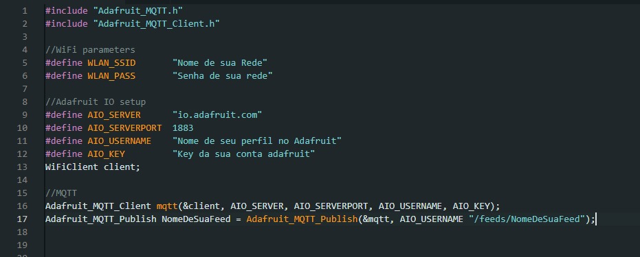
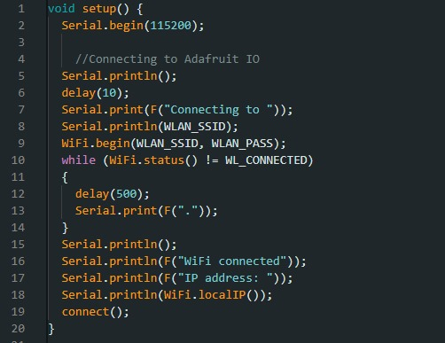
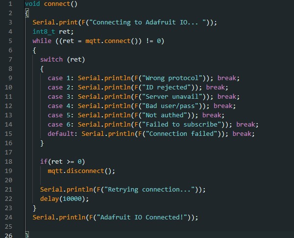
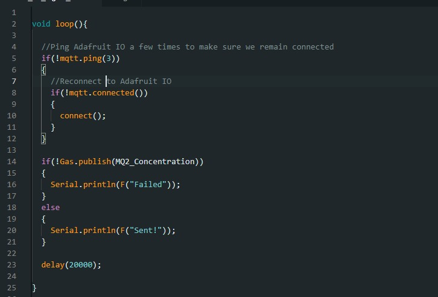

# Passo a passo Adafruit.IO:

## 1. Criar conta / Login:

Ir até [io.adafruit.com](https://io.adafruit.com) e criar uma conta ou, caso já tenha, faça o login;

## 2. Criar a feed:

Crie uma feed para cada um dos dados que cada um dos sensores irão captar. Nomes simples facilitarão a utilização das feeds no código posteriormente;

## 3. Criar Dashboard

Crie uma dashboard. Após, crie blocos linkados a cada uma das feeds para que você tenha todos os dados exibidos corretamente;

## 4. Código:

### 4.1. Conexão:

Certifique-se de estar utilizando as bibliotecas;  
Preencha corretamente seus dados de rede;
 
Crie uma variavel tipo 'Adafruit_MQTT_Publish' com o nome de sua feed e altere o "/feeds/NomeDeSuaFeed";

### 4.2. setup():

Dentro da função setup(), copie o código que configurará o ESP32 com as configurações de rede;

### 4.3. Função connect():

Copie a função connect() que conectará o ESP32 ao adafruit;

### 4.4. loop():

Copie o código abaixo que manterá o ESP32 e o adafruit conectados e enviará os dados coletados pelos sensores ao adafruit;  
Certifique-se de colocar o nome de sua feed corretamente em: !NomeDeSuaFeed.publish;  
Coloque entre os parenteses o nome da sua variável responsável por armazenar o dado coletado pelo sensor;  

